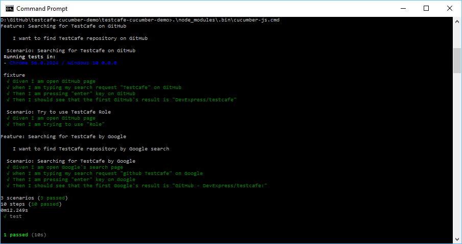

# An example of using TestCafe and CucumberJS

This is a demonstration of integration [TestCafe](https://github.com/DevExpress/testcafe) into [CucumberJS](https://github.com/cucumber/cucumber-js) tests.

## Requirements
* TestCafe
* CucumberJS

To install it, use the `npm install` command.

## Running tests

You can run tests by executing the `.\node_modules\.bin\cucumber-js.cmd` or `npm test` commands in command prompt

